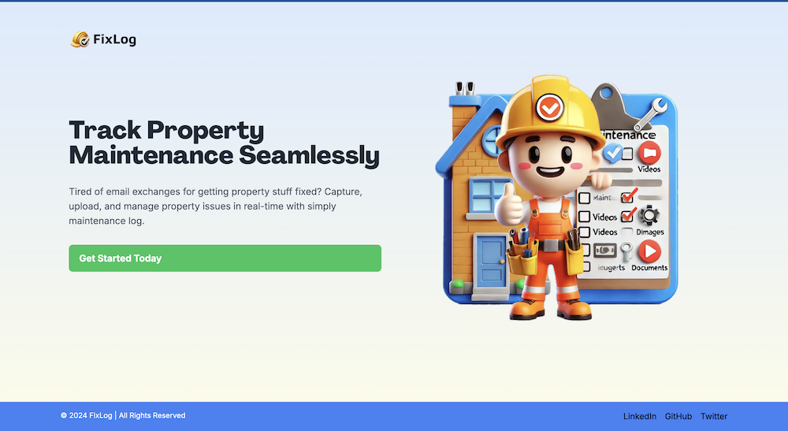
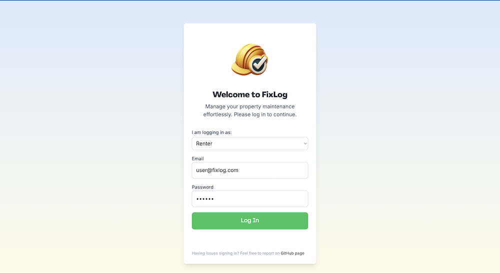

# FixLog Demo - Property Maintenance Tracker

This full-stack web application was built as part of the [Pinata](https://pinata.cloud/) Hackathon Challenge hosted by [DEV.to](https://dev.to/t/hackathon). It took around 24 hours to develop and submit this project. Leveraged Pinata SDK to upload media files (images) to the IPFS network via Next.js API routes. Hosted on Vercel.

## Tech stack
- Frontend: Next.js, React, TypeScript
- Backend: Next.js API routes, Pinata IPFS, PostgreSQL (for authentication and user data)
- File Upload: Pinata SDK (for security, dummy data only)
- Authentication: NextAuth.js (email/password)

## Screenshots

### Homepage

### Login

### Renter Dashboard

## Limitations
- **Storage capacity**: For demo version issue submission form data is stored in local storage, which can hold up to 10MB data. Thus, attempting to attach large files may fail. 
- **Login**: You can login with test account only. 
